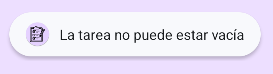

Programación Multimedia y Dispositivos móviles

AE-1. Tarea grupal. Mejora de aplicación ToDo List.

Realizada por:

ALBERTO ARROYO SANTOFIMIA

Nuestro objetivo en esta tarea de equipo es mejorar la aplicación que
hemos realizado en la unidad 2 TodoList, para ello, haréis lo siguiente
(Uso de Firebase para el almacenamiento de los datos.):

ToDoList

1.  Cambiar el icono genérico de la app por otro de tu elección.

2.  Pantalla inicial de Splash que de paso al login/registro con
    FireBase Authentication.

3.  Agregar imágenes o iconos a los botones

4.  Cambiar los iconos de los botones del Appbar \"añadir tarea\" y
    \"logout\".

5.  Poner avisos de tipo Toast personalizados (texto e imagen) para los
    eventos de las tareas: usuario registrado y tarea realizada.

6.  Incluir un botón de edición para cada una de las tareas para poder
    modificar su texto: aparecerá un cuadro de diálogo con el texto de
    la tarea original para su modificación por un texto nuevo. Los
    cambios se deben reflejar en la base de datos y en la interfaz de la
    app.

7.  Verificar el contenido de los formularios cuando sea necesario (que
    los inputs no estén vacíos, longitud, formato, etc.).

8.  Originalidad y creatividad: cambiar los estilos, paleta de colores,
    tipografías, uso de degradados, animaciones, sonidos, imágenes,
    ilustraciones, etc. (pero sin hacer un gazpacho!!). También se
    tendrá en cuenta cualquier otra funcionalidad añadida a la
    aplicación (por ejemplo, login con RRSS, etc.).

